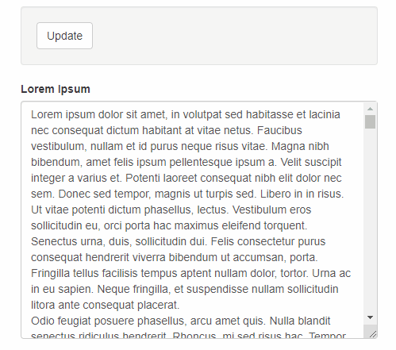

```{r setup, include = FALSE}
knitr::opts_chunk$set(
  collapse = TRUE,
  comment = "#>",
  eval = TRUE,        
  echo = TRUE,         # echo code?
  message = TRUE,     # Show messages
  warning = TRUE,     # Show warnings
  fig.width = 8,       # Default plot width
  fig.height = 6,      # .... height
  dpi = 200,           # Plot resolution
  fig.align = "center"
)
knitr::opts_chunk$set()  # Figure alignment   
library(shinyGizmo)
set.seed(123)
options(tibble.width = Inf)
```

# shinyGizmo

[]()
[](https://www.tidyverse.org/lifecycle/#stable)

## Overview

shinyGizmo is an R package providing useful components for Shiny applications.

<center>
## <span style="color:blue"> shinyGizmo 0.1 is now available!</span>
</center>

## Installation

From CRAN:
```
install.packages("shinyGizmo")
```

Lastest development version from Github:
```
remotes::install_github(
  "r-world-devs/shinyGizmo"
)
```

## Available components

### pickCheckboxInput - make selection in many groups at once


### accordion - light and simple version of accordion 

 

### modalDialogUI - create modals directly in UI


### valueButton - get any attribute from Shiny application DOM objects


### textArea - Non-binding version of `shiny::textAreaInput`.


Improves application performance when large amount text is passed to text area.
Works great with `valueButton`.

## Lifecycle

shinyGizmo 0.1 is stable but we're still developing the package. 
If you find bugs or have any suggestions for future releases post an issue on GitHub page at <https://github.com/r-world-devs/shinyGizmo/issues>.

## Getting help

There are two main ways to get help with `shinyGizmo`

1. Reach the package author via email: krystian8207@gmail.com.
2. Post an issue on our GitHub page at [https://github.com/r-world-devs/shinyGizmo](https://github.com/r-world-devs/shinyGizmo/issues).
