# shinyGizmo

[](https://img.shields.io/static/v1.svg?label=github.com&message=v.0.1&color=ff69b4)
[](https://lifecycle.r-lib.org/articles/stages.html#stable)

## Overview

shinyGizmo is an R package providing useful components for Shiny
applications.

<center>

## <span style="color:blue"> shinyGizmo 0.5.0 is now available!</span>

</center>

## Installation

From CRAN:

    install.packages("shinyGizmo")

Latest development version from Github:

    remotes::install_github(
      "r-world-devs/shinyGizmo"
    )

## Available components

### `conditionalJS` - extended version of `shiny::conditionalPanel`.

Allows to attach conditional JavaScript action to be run on UI element.

Use predefined actions such as `disable`, `attachClass`, `css`, `show`,
`runAnimation` or define a custom one.

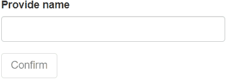 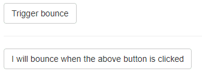

### `commonInput(s)` - merge multiple input controllers into one

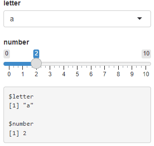

### `accordion` - light and simple version of accordion

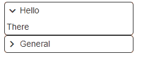 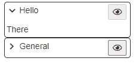

### `modalDialogUI` - create modals directly in UI

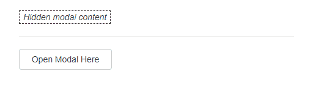

### `valueButton` - get any attribute from Shiny application DOM objects

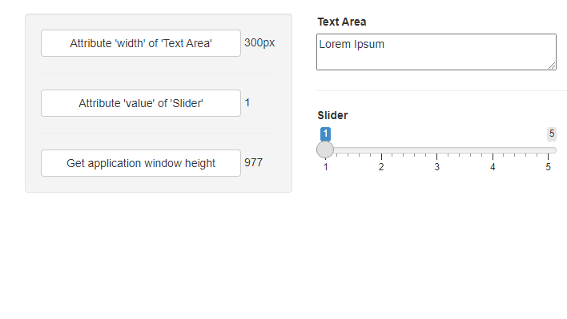

### `textArea` - non-binding version of `shiny::textAreaInput`.

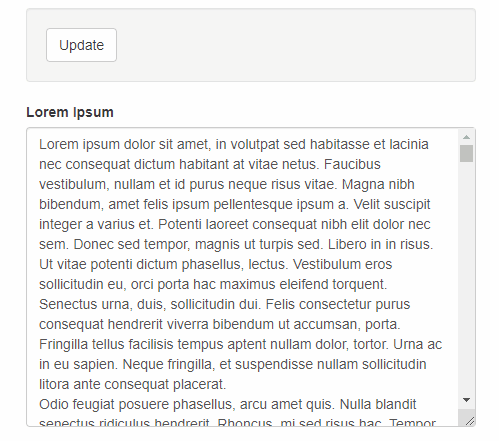

Improves application performance when large amount text is passed to
text area. Works great with `valueButton`.

### `pickCheckboxInput` and `vsCheckboxInput` - make selection in many groups at once

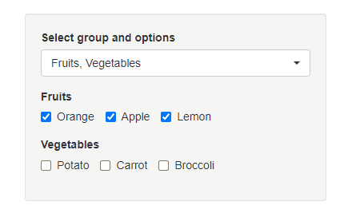

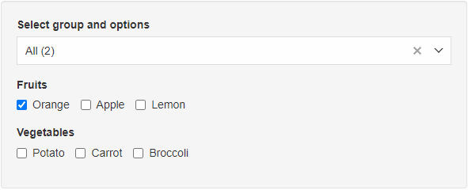

### `container` + `grid` - responsive layouts with CSS Container Queries

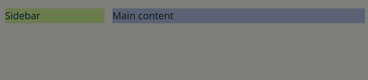

Build responsive layouts that adapt based on the container’s own
dimensions rather than the viewport using [CSS Container
Queries](https://developer.mozilla.org/en-US/docs/Web/CSS/CSS_containment/Container_queries)
and [CSS Grid
Layout](https://developer.mozilla.org/en-US/docs/Web/CSS/CSS_grid_layout).
Combine `container()` with `condition()` to define CSS rules at
different breakpoints, and use `grid()` / `grid_item()` as composable
helpers for CSS Grid layouts.

``` r
container(
  name = "dashboard",
  div(class = "sidebar", "Sidebar", style = "background-color:") |> grid_item(area = "sidebar"),
  div(class = "main", "Main content") |> grid_item(area = "main"),
  conditions = list(
    condition(
      !!!grid(
        template_areas = list(c("sidebar", "main")),
        template_columns = "250px 1fr",
        gap = "16px"
      )
    ),
    condition(
      query = "width < 700px",
      !!!grid(
        template_areas = list(c("sidebar"), c("main")),
        gap = "12px"
      )
    )
  )
)
```

Key features: - **`container()`** - wraps elements with `container-type`
/ `container-name` for CSS Container Queries - **`condition()`** -
defines CSS rules for a specific container query (or unconditionally
when `query = NULL`); supports `.extra_css` for targeting child
selectors - **`grid()`** - generates CSS Grid properties
(`template_areas`, `template_columns`, `auto_fill`, etc.) as a named
list for splicing into `condition()` via `!!!` - **`grid_item()`** -
pipe-friendly helper to set `grid-area`, `grid-row`, `grid-column` on
individual elements

See `examples/container.R` for a full demo app with nested containers,
auto-fill grids, and explicit row/column spanning.

## Lifecycle

shinyGizmo is stable but we’re still developing the package. If you find
bugs or have any suggestions for future releases post an issue on GitHub
page at <https://github.com/r-world-devs/shinyGizmo/issues>.

## Getting help

There are two main ways to get help with `shinyGizmo`

1.  Reach the package author via email: <krystian8207@gmail.com>.
2.  Post an issue on our GitHub page at
    [https://github.com/r-world-devs/shinyGizmo](https://github.com/r-world-devs/shinyGizmo/issues).
