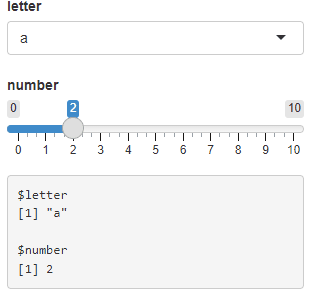

# shinyGizmo

## Overview

shinyGizmo is an R package providing useful components for Shiny
applications.

##  shinyGizmo 0.4.2 is now available!

## Installation

From CRAN:

    install.packages("shinyGizmo")

Latest development version from Github:

    remotes::install_github(
      "r-world-devs/shinyGizmo"
    )

## Available components

### `conditionalJS` - extended version of `shiny::conditionalPanel`.

Allows to attach conditional JavaScript action to be run on UI element.

Use predefined actions such as `disable`, `attachClass`, `css`, `show`,
`runAnimation` or define a custom one.

 

### `commonInput(s)` - merge multiple input controllers into one

### `accordion` - light and simple version of accordion

 

### `modalDialogUI` - create modals directly in UI

### `valueButton` - get any attribute from Shiny application DOM objects

### `textArea` - non-binding version of `shiny::textAreaInput`.

Improves application performance when large amount text is passed to
text area. Works great with `valueButton`.

### `pickCheckboxInput` and `vsCheckboxInput` - make selection in many groups at once

## Lifecycle

shinyGizmo is stable but we’re still developing the package. If you find
bugs or have any suggestions for future releases post an issue on GitHub
page at <https://github.com/r-world-devs/shinyGizmo/issues>.

## Getting help

There are two main ways to get help with `shinyGizmo`

1.  Reach the package author via email: <krystian8207@gmail.com>.
2.  Post an issue on our GitHub page at
    [https://github.com/r-world-devs/shinyGizmo](https://github.com/r-world-devs/shinyGizmo/issues).
